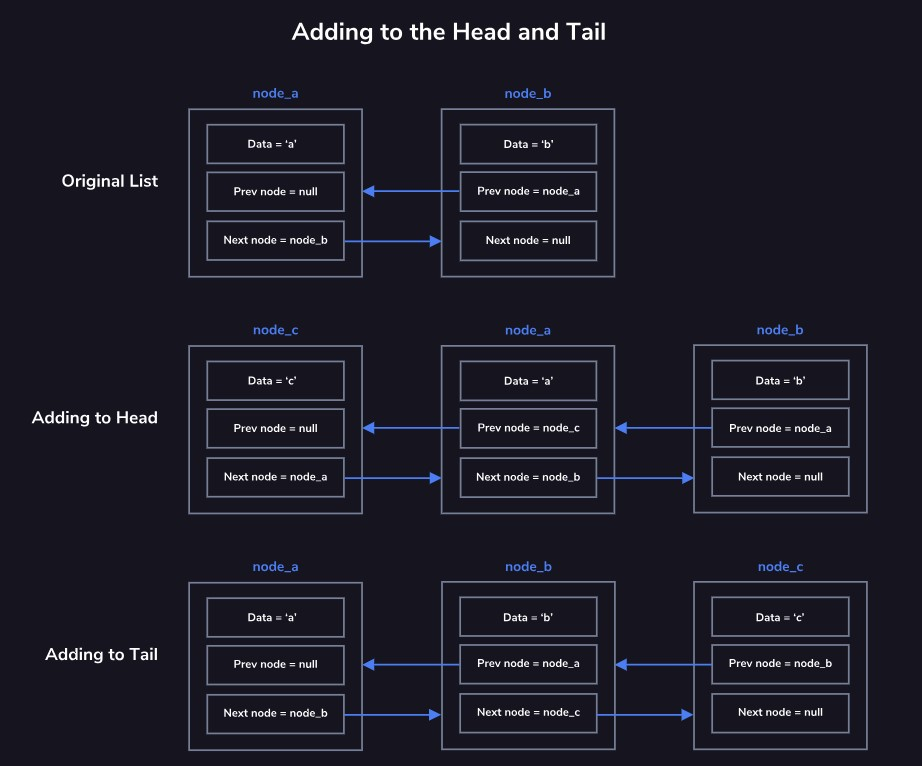
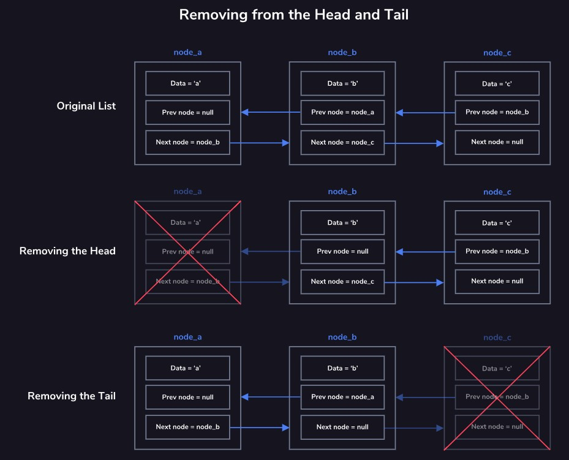
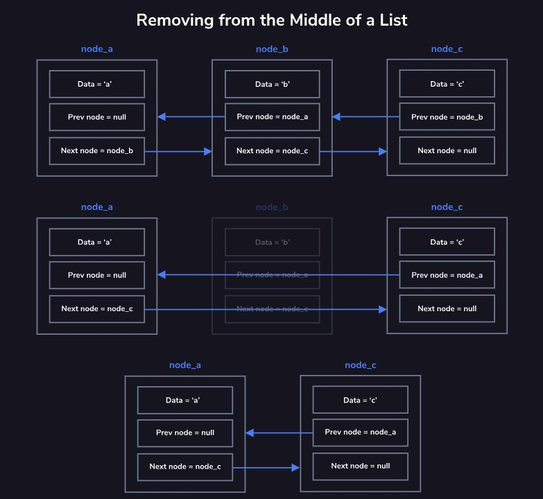

# Doubly Linked Lists

## Introduction

A doubly linked list is a data structure consisting of a series of nodes, similar to a singly linked list. However, each node in a doubly linked list contains not only data but also two links (or pointers) to the preceding and succeeding nodes in the list. The first node is known as the head node, and the last node is called the tail node. In the head node, the previous pointer points to null, and in the tail node, the next pointer points to null.

## Example

A practical example of a doubly linked list is a daily commute on a subway. Your home may be considered the head of the list, your workplace as the tail, and all the stops you pass through as nodes in the list. In the morning, when you travel to work, you traverse the list from the head to the tail using the next pointer. A doubly linked list enables you to traverse back through the list easily, using the previous pointer, as when you return home in the evening, taking the same route in reverse order.

## Common Operations

Some common operations involving doubly linked lists include:

- Adding nodes to both ends of the list
- Removing nodes from both ends of the list
- Finding and removing a node from any location in the list
- Traversing (or navigating through) the list

## Adding Nodes

Adding nodes to a doubly linked list can be a bit more intricate than in a singly linked list, considering the need to maintain and update the node's previous pointer and possibly update the tail of the list.

### Adding to the Head

Adding a node to the head of a doubly linked list requires checking whether the current list has a head node. If not, the list is empty, and the new node will become both the head and tail of the list, with both pointers set to null. When the list is not empty, you should:

- Set the current head's previous pointer to the new head
- Set the new head's next pointer to the current head
- Set the new head's previous pointer to null

### Adding to the Tail

Similar to adding to the head, there are two scenarios when adding a node to the tail of a doubly linked list. If the list is empty, the new node will be both the head and tail of the list, and pointers are set to null. For a non-empty list:

- Set the current tail's next pointer to the new tail
- Set the new tail's previous pointer to the current tail
- Set the new tail's next pointer to null

## Removing from the Head and Tail

Due to the extra pointer and tail property, removing the head from a doubly linked list is slightly more complicated than removing the head from a singly linked list. However, the previous pointer and tail property simplify removing the tail of the list, as you don't need to traverse the entire list for the operation.

### Removing the Head

Removing the head involves updating the pointer at the beginning of the list. Set the previous pointer of the new head (the element right after the current head) to null, and update the head property of the list. If the head was also the tail, the tail removal process will occur as well.

### Removing the Tail

Removing the tail involves updating the pointer at the end of the list. Set the next pointer of the new tail (the element right before the tail) to null, and update the tail property of the list. If the tail was also the head, the head removal process will occur as well.

### Removing from the Middle

In a doubly linked list, it is possible to delete a node that is not located at the beginning or the end of the list. This situation requires updating the pointers of the node's predecessor and successor as follows:

- The predecessor node's next pointer should be updated to point to the successor node.
- The successor node's previous pointer should be updated to point to the predecessor node.

It is not necessary to update the pointers of the removed node. Modifying the pointers of its neighboring nodes will effectively remove it from the list. If no nodes in the list point to it, the node will become an orphaned node.

# Key Takeaways

Doubly Linked Lists:

- Consist of nodes that have links to the preceding and subsequent nodes
- Offer the ability to traverse in both forward and backward directions
- Feature a pointer to the initial node, referred to as the head, which is the first node in the list
- Feature a pointer to the final node, referred to as the tail, which is the last node in the list
- Necessitate updating the head's pointers following the addition to or removal from the head
- Necessitate updating the tail's pointers following the addition to or removal from the tail
- Necessitate updating the surrounding nodes' pointers following removal from the middle of the list

Another example of a doubly linked list in computer use is your browser's history. When you open your browser, the page you land on becomes the head of your list. As you navigate to new pages by clicking on links, you add to the tail of your list. If you wish to return to something you have already visited, you can use the "back" button to move backward through your list. Can you think of another computer use case for a doubly linked list?
