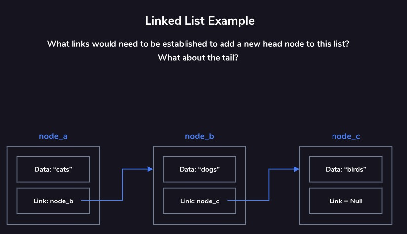

# Linked Lists

## Introduction

Connecting [nodes](./Nodes.md) via their `next` property creates a singly linked list. Singly linked lists are versatile, simple, and often serve as building blocks for more complex data structures. They provide an alternative to arrays when storing information in a linear fashion.

## Example

A linked list is made up of a series of nodes, as shown in the diagram below. The head node is the node at the beginning of the list, while the tail node terminates the list by having a `null` link.

In the context of air travel, the linked list could represent a one-way itinerary, where nodes represent airports and links represent air travel segments. The initial departure city is the head node, and the final arrival city is the tail node.

## Memory Usage

Since nodes are linked to one another through memory references, the nodes in a linked list do not need to be sequentially located in memory. This feature enables quick insertion and removal of nodes, as we will see in future exercises.

## Operations

Common operations on linked lists include:

- Adding nodes
- Removing nodes
- Finding a node
- Traversing (or iterating through) the linked list

Extra care must be taken when adding or removing nodes due to the unidirectional nature of the links.

### Adding a new node

To add a new node to the beginning of the list, link the new node to the current head node, preserving the connection with the following nodes.

### Removing a node

Careful maintenance is required when removing a node from the middle of a linked list. To properly maintain the list, adjust the link on the previous node so that it points to the following node.

In some programming languages, unreferenced nodes are automatically removed. In this context, "removing" a node is equivalent to removing all references to the node.

## Variants

Linked lists typically use unidirectional links (next node), but some implementations may use bidirectional links (both next and previous nodes).
