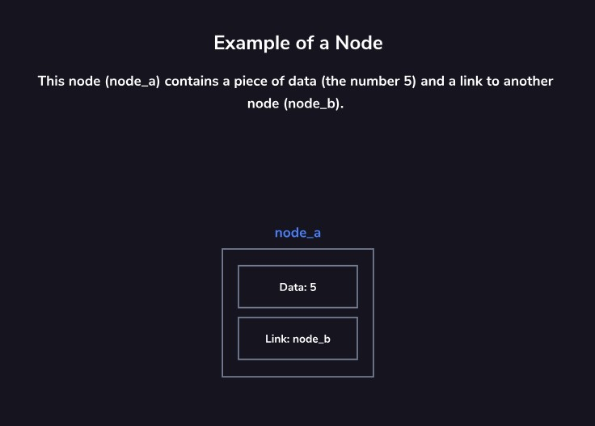
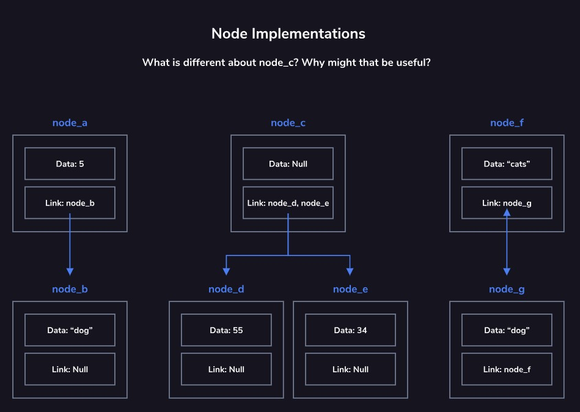
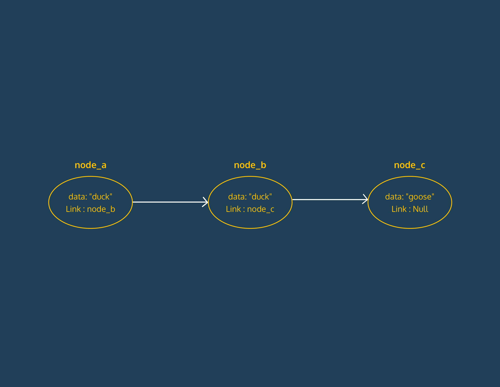

# Nodes

## About Nodes

Nodes are a fundamental concept in computer science data structures. They are used as building blocks for linked lists, stacks, queues, trees, and more. At their core, a node stores data and maintains links to other nodes. The nature of these links and the data they carry can vary depending on the specific data structure.

## Anatomy of a Node

A node has two main components: the data and the links. The data can be of different types, such as integers, strings, decimals, arrays, or null. The link or links within a node are sometimes called pointers, as they point to another node.

## Node Implementations

Data structures usually implement nodes with one or more links (pointers to other nodes). If these links are null, it signifies the end of the path you were following. Various node implementations are illustrated in the diagram, showing different types of data and link configurations.

## Node Linking

In some data structures, a node may only be linked to from a single other node. This makes it crucial to carefully consider how nodes are modified or removed. If the link to a node is accidentally removed, the node and its linked nodes may become "lost" to the application, known as an orphaned node.

## Key Takeaways

- Nodes carry data, which can be of various types.
- Nodes contain links (pointers) to other nodes, and if all the links are null, the path has ended.
- Orphaned nodes occur when there are no existing links to them.
