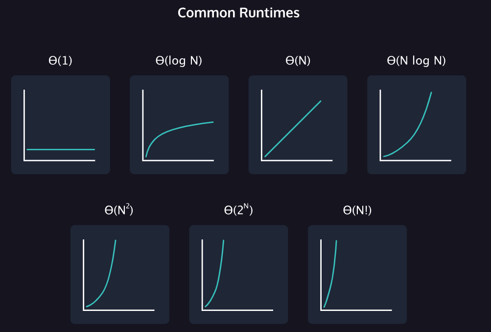

# Asymptotic Notation

## Why Asymptotic Notation?

Learn why asymptotic notation is an essential tool for becoming an efficient programmer.

When writing programs, it’s important to make smart programming choices so that code runs most efficiently. Computers seem to take no time evaluating programs, but when scaling programs to deal with massive amounts of data, writing efficient code becomes the difference between success and failure. In computer science, we define how efficient a program is by its runtime.

We can’t just time the program, however, because different computers run at different speeds. My dusty old PC does not run as fast as your brand new laptop. Programming is also done in many different languages, how do we account for that in the runtime? We need a general way to define a program’s runtime across these variable factors. We do this with Asymptotic Notation.

With asymptotic notation, we calculate a program’s runtime by looking at how many instructions the computer has to perform based on the size of the program’s input. For example, if I were calculating the maximum element in a collection, I would need to examine each element in the collection. That examining step is the same regardless of the language used, or the CPU that’s performing the calculation. In asymptotic notation, we define the size of the input as N. I may be looking through a collection of 10 elements, or 100 elements, but we only need to know how many steps are performed relative to the input so N is used in place of a specific number. If there is a second input, we may define the size of that input as M.

There are varieties of asymptotic notation that focus on different concerns. Some will communicate the best case scenario for a program. For example, if we were searching for a value within a collection, the best case would be if we found that element in the first place we looked. Another type will focus on the worst case scenario, such as if we searched for a value, looked in the entire dataset and did not find it. Typically programmers will focus on the worst case scenario so there is an upper bound of runtime to communicate. It’s a way of saying “things may get this bad, or slow, but they won’t get worse!”

# Describing Runtime

We use asymptotic notation to describe the runtime of a program. The three types of asymptotic notation are big Theta, big Omega, and big O.

## Big O Notation

We use big O (O) to describe the worst-case running time of a program.We typically describe a program’s running time in terms of big O since we usually care about the worst case scenario.

## Big Theta

We use big Theta (Θ) to describe the runtime if the runtime of the program is the same in every case.

## Big Omega

We use big Omega (Ω) to describe the best-case running time of a program.

## Execution Count

You may also see the term execution count used in evaluating algorithms. Execution count is more precise than Big O notation. Determining execution count can increase in difficulty as our algorithms become even more sophisticated! But regardless of the execution count, the number of operations grows roughly proportionally with n. If n doubles, the number of operations will also roughly double.

When finding the runtime of a program with multiple steps, you can divide the program into different sections and add the runtimes of the various sections. You can then take the slowest runtime and use that runtime to describe the entire program.
When analyzing the runtime of a program, we care about which part of the program is the slowest.

## Common Runtimes

The different common runtimes from fastest to slowest are: Θ(1), Θ(log N), Θ(N), Θ(N log N), Θ(N2), Θ(2N), Θ(N!).

**- Θ(1)**. This is constant runtime. This is the runtime when a program will always do the same thing regardless of the input. For instance, a program that only prints “hello, world” runs in Θ(1) because the program will always just print “hello, world”.
**- Θ(log N)**. This is logarithmic runtime. You will see this runtime in search algorithms.
**- Θ(N)**. This is linear runtime. You will often see this when you have to iterate through an entire dataset.
**- Θ(N\*logN)**. You will see this runtime in sorting algorithms.
**- Θ(N2)**. This is an example of a polynomial runtime. When N is raised to the 2nd power, it’s known as a quadratic runtime. You will see this runtime when you have to search through a two-dimensional dataset (like a matrix) or nested loops.
**- Θ(2N)**. This is exponential runtime. You will often see this runtime in recursive algorithms (Don’t worry if you don’t know what that is yet!).
**- Θ(N!)**. This is factorial runtime. You will often see this runtime when you have to generate all of the different permutations of something. For instance, a program that generates all the different ways to order the letters “abcd” would run in this runtime.



# Comparing Data-Structure Runtimes

## Stack Runtimes vs Queue Runtimes

In addition to analyzing the runtimes of various data structures, it is also important to compare the runtimes of different data structures. We will compare the runtimes of retrieving the first value added to a queue to the runtime of retrieving the first value added to a stack.

### Removing the First Value Added to a Queue

A queue is a FIFO (first in, first out) data structure, which means that the first element added to it, will always be the first element removed from it. Removing this element does not require you to iterate through the queue.

### Removing the First Value Added to a Stack

On the other hand, a stack is a FILO (first in, last out) data structure. This means that the first element added will be the last element removed. Removing this element will require you to iterate through the stack, all the way to the bottom.

The big O runtime of removing the first element added to a Queue is **O(1)**, and the big O runtime of removing the first element added to a Stack is **O(n)**.

Since the element will be at the head of the queue, removing it is one step, so it is O(1). On the other hand, since the element will be at the bottom of the stack, removing it requires iterating through the whole stack, so it is O(n).
While finding the first value added to a queue has a better big O runtime than doing so in a stack, consider finding the last value added. In a queue, we will have to iterate through the entire queue to retrieve the element at the end. This will be a big O runtime of O(n). On the other hand, the last value added to a stack is the value at the top of the stack, so removing it will just be a big O runtime of O(1).

## Hash Map Runtimes vs Linked List Runtimes

Similarly, let’s compare the runtimes of searching for a particular element in a linked list and in a hash map.

### Retrieving an Element from a Linked List

To find an element in a linked list, we will have to search through the entire list to see if the element is there. Refer to the findMax() function we looked at above for an example. Iterating through the list means that this process has a big O runtime of O(n).

### Retrieving an Element from a Hash Map

Retrieving an element from a hash map is more efficient, due to its structure. Hash maps store information using key-value pairs, which means that every value is linked to a unique key. In order to find the value from the key, it uses the hash function, which has a big O runtime of O(1). If you don’t have to search through the entire data structure, retrieving an element from a hash map is faster than retrieving an element from a linked list.

However, there is the possibility that the element you are looking for is not at the spot that you expect it to be. This happens when two keys have the same hash. There are a few ways hash maps resolve this issue, including separate chaining and open addressing.

#### Separate Chaining

One way to solve hash map collisions is to create a linked list at the array index where the collision occurred. All elements that hash to the same index will be in that list. This means that to find an element in a hash map that uses separate chaining, you must first find the correct index, and then search through the list at that index (if there is more than one element).

Given the multiple steps required to retrieve an element from a hash map that uses separate chaining, rhe worst case would be that all elements in the hash map hashed to the same index and are in one linked list with the element you’re looking for at the end of the list. To find it, you would have to iterate through the list, which means the big O runtime is O(n).

#### Open Addressing

Another way to solve hash map collisions is to simply move down the array until you find an open index, and place the element there. This is a type of open addressing that is called linear probing. When retrieving an element from a hash map that uses linear probing, the worst case would be if the element hashes to the first index, but is actually at the last index. Since you would have to search through the entire array, the big O runtime for retrieving an element from this kind of hash map is O(n).

## Space Complexity

Learn about the concept of space complexity using examples in JavaScript.

Asymptotic notation is often used to describe the runtime of a program or algorithm, but it can also be used to describe the space, or memory, that a program or algorithm will need. Think about a simple function that takes in two numbers and returns their sum:

```Javascript
function addNumbers(a, b) {
  return a + b;
}
```

This function has a space complexity of O(1), because the amount of space it needs will not change based on the input. While this function also has a constant runtime of O(1), most functions do not have matching space and time complexities:

```Javascript
function simpleLoop(inputArray) {
  for (let i = 0; i < inputArray.length; i++) {
    console.log(i);
  }
}
```

As we know, a simple for loop that goes through every element in an array of size n has a linear runtime of O(n). However, this function takes O(1) space since no new variables are being created and therefore no more space must be allocated.

A recursive function that is passed the same array or object in each call doesn’t add to the space complexity if the array or object is passed by reference (which it is in JavaScript).

Like with time complexity, space complexity denotes space growth in relation to the input size. **It’s also important to note that space complexity usually refers to any additional space that will be needed, and doesn’t count the space of the input.** So a function could have 10 arrays passed into it, but if all it does inside is print 'Hello World!', then it still takes O(1) space.

Space complexity is important to consider alongside time complexity when comparing data structures and algorithms. While two functions may have very similar runtimes, one could use less space. Consider the doubleArray() function from below. It has a runtime of O(n), and takes O(n) space. Could we optimize it to have a better space complexity?

```Javascript
function doubleArray(inputArray) { // Returns an array that is the double of the input array
  const doubledArray = [];
  for (let i = 0; i < inputArray.length; i++) {
    doubledArray[i] = 2 * inputArray[i];
  }
  return doubledArray;
}

```

```Javascript
function doubleInPlace(inputArray) {
  for (let i = 0; i < inputArray.length; i++) {
    inputArray[i] *= 2;
  }
  return inputArray;
}
```

doubleInPlace() does the same thing as doubleArray() and in the same amount of time, but only takes O(1) space, simply because it doesn’t create a new array. As you move forward, remember that just because a program has the best runtime possible, doesn’t mean it can’t still be optimized.
