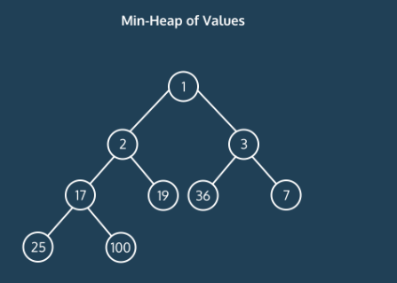

# Graph Traversals

Using graphs to model complex networks is pretty swell, but one way that graphs can really come in handy is with graph search algorithms. You can use a graph search algorithm to traverse the entirety of a graph data structure in search of a specific vertex value.

There are many ways to traverse a graph, but you will focus on three methods: depth-first search (DFS), breadth-first search (BFS), and Dijkstra’s algorithm. These traversal methods are core algorithms for searching a graph.

## Enabling Search

To enable searching, we add vertices to a list, visited. This list is pretty important because it keeps the search from visiting the same vertex multiple times! This is particularly vital for cyclical graphs where you might otherwise end up in an infinite loop.

## Runtime

So how do you calculate the runtime for graph search algorithms?

In an upper bound scenario, we would be looking at every vertex and every edge. Because of this, the big O runtime for both depth-first search and breadth-first search is O(vertices + edges).

## Depth-First Search

Simply put, a depth-first graph search continues down a path until it reaches the end. It is helpful for determining if a path exists between two vertices. DFS has many applications, including topological sorting and detecting cycles, but one of the more interesting real-world applications is that it can be used to solve problems that have a singular correct answer (a path between the start state and end state), such as a sudoku exercise.

### Depth-First Search (DFS) Conceptual

Imagine you’re in a car, on the road with your friend, “D.” D is on a mission to get to your destination by process of elimination. D won’t stop and ask for directions. D just sticks to a chosen path until you reach the end.

At that point, if the end wasn’t actually your destination, D brings you back to the last point when there was an intersection and tries another path.

Like your friend D, depth-first search algorithms check the values along a path of vertices before moving to another path.

While this isn’t exactly ideal when you want to find the shortest path between two points, DFS can be very helpful for determining if a path even exists.

In order to accomplish this path-finding feat, DFS implementations use either a stack data structure or, more commonly, recursion to keep track of the path the search is on and the current vertex.

In a stack implementation, the most recently added vertex is popped off the stack when the search has reached the end of the path. Meanwhile, in a recursive implementation, the DFS function is recursively called for each connected vertex.

### Graph Search Traversal Order

What if you don’t need to find a path, but you do need to get a list of all the values in a graph?

Well, it turns out that in addition to path-finding, depth-first search is pretty adept at organizing vertices (or vertex values) with a clear order of visitation from beginning to end.

There are three main traversal orders that you’ll come across for graph traversal:

- **Preorder**, in which each vertex is added to the “visited” list and added to the output list BEFORE getting added to the stack
- **Postorder**, in which each vertex is added to the “visited” list and added to the output list AFTER it is popped off the stack
- **Reverse Post-Order** (also known as Topological Sort), which returns an output list that is exactly the reverse of the post-order list

Take a look at the directed graph structure we have depicted here. Let’s say that we want a list of all vertex values, starting with “Lasers”, in the order that they are added to the stack.

A pre-order DFS traversal would come in handy and we might end up with the following list. (We’ll assume here that this algorithm prefers visiting things in alphabetical order if there is a choice.):

["Lasers", "Lava", "Snakes", "Spikes", "Piranhas"]

Now, let’s say we want the same values, but with each value only added to the list once its vertex has been popped from the stack. In this case, our post-order DFS traversal would result in a list that looked like:

["Spikes", "Snakes", "Lava", "Piranhas", "Lasers"]

You may notice that the post-order list is not the reverse of the pre-order list. A reverse post-order list would still begin with “Lasers”, but then begin to differ:

["Lasers", "Piranhas", "Lava", "Snakes", "Spikes"]

What happens if there are unvisited vertices that are not reachable from the current path? The search would visit them in (here alphabetical) order after exploring the current path.

## Breadth-First Search

On the other hand, a breadth-first graph search approach checks the values of all neighboring vertices before moving into another level of depth. This is an incredibly inefficient way to find just any path between two vertices, but it’s an excellent way to identify the shortest path between them. Because of this, BFS is helpful for figuring out directions from one place to another.

### Breadth-First Search (BFS) Conceptual

You’re back in a car, but this time, your friend “B” is navigating. Unlike D, B is a bit hesitant about whether you’ve gone the right way and keeps checking in to see if you are on the best path. At each intersection, B tries out each possible route one by one, but only for a block in each direction to see if you’ve found your destination.

Like B, breadth-first search, known as BFS, checks the values of all neighboring vertices before moving into another level of depth.

This is an incredibly inefficient way to find just any path between two points, but it’s an excellent way to identify the shortest path between two vertices. Because of this, BFS is helpful for figuring out directions from one place to another.

Unlike DFS, BFS graph search implementations use a queue data structure to keep track of the current vertex and vertices that still have unvisited neighbors. In BFS graph search a vertex is dequeued when all neighboring vertices have been visited.

## Dijkstra’s Algorithm

Dijkstra’s algorithm is a method for finding the shortest distance from a given point to every other point in a weighted graph. The algorithm works by keeping track of all the distances and updating the distances as it conducts a breadth-first search. A common application of this algorithm is to find the quickest route from one destination to another.

### Intro to Dijkstra's Algorithm: Conceptual

Now that we know how to properly search a graph, how can we use these skills in real life?

One of the most common applications of graph searches is to find the shortest distance between vertices. Finding this distance has a variety of applications such as finding the optimal route to a destination or transferring data in a computer network.

Take a look at the graph below. Finding the shortest path between vertex A and vertex E may seem easy in your brain, but telling a computer how to find it is a bit more complicated.


Fortunately, there is an algorithm that computes the shortest distance from a given vertex to the rest of the vertices in a graph. This is called Dijkstra’s Algorithm.

Dijkstra’s Algorithm works as following:

1. Instantiate a dictionary that will eventually map vertices to their distance from the start vertex
1. Assign the start vertex a distance of 0 in a min heap
1. Assign every other vertex a distance of infinity in a min heap
1. Remove the vertex with the smallest distance from the min heap and set that to the current vertex
1. For the current vertex, consider all of its adjacent vertices and calculate the distance to them as (distance to the current vertex) + (edge weight of current vertex to adjacent vertex).
1. If this new distance is less than the current distance, replace the current distance.
1. Repeat 4 and 5 until the heap is empty
1. After the heap is empty, return the distances

In pseudocode

```pseudocode
- Set all distances to all other vertices from start vertex to infinity
- while heap exists:
    - pop vertex with mininum distance
    - check neighbors of that vertex:
          - new distance = distance to vertex + edge weight
          - if new distance > current distance:
                 - replace current distance with new distance
- return distances
```

### Dijkstras Algorithm: Conceptual Runtime

How efficient is Dijkstra’s algorithm? Let’s break it into different parts:

- Searching through the graph
- Keeping track of distances

Just like breadth-first search and depth-first search, to search through an entire graph, in the worst case, we would go through all of the edges and all of the vertices resulting in a runtime of O(E + V).

For Dijkstra’s, we use a min-heap to keep track of all the distances. Searching through and updating a min-heap with V nodes takes O(log V) because in each layer of the min-heap, we reduce the number of nodes we are looking at by a factor of 2.



In the worst case, we would update the min-heap every iteration. Since there are at most E + V iterations of Dijkstra’s and it takes log V to update a min-heap in the worst case, then the runtime of Dijkstra’s is O((E+V)log V).
