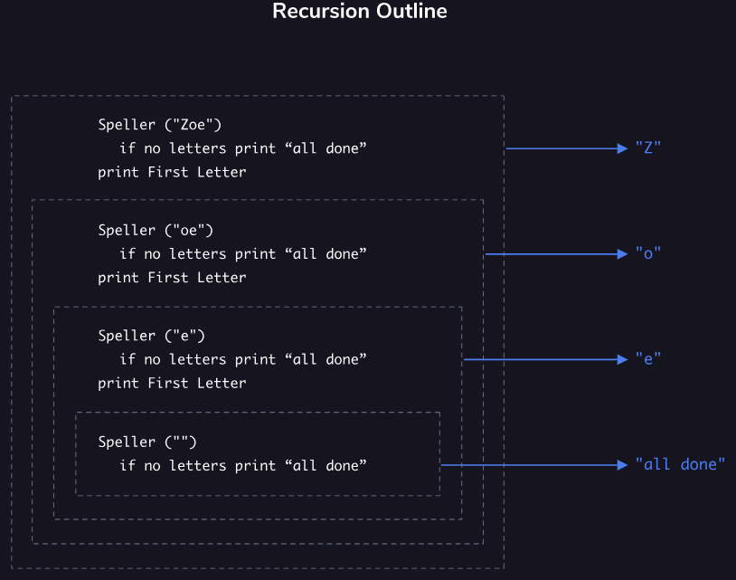

# Recursion

Recursion is a strategy for solving problems by defining the problem in terms of itself. For example, to sum the elements of a list we would take the first element and add it to the sum of the remaining elements.

How would we get that sum of remaining elements? Easy! We’d take the first element of the remaining elements and add it to the… Maybe you can understand why recursion can be a tricky subject!

In programming, recursion means a function definition will include an invocation of the function **within its own body**. Here’s a pseudo-code example:

```pseudocode
define function, speller
  if there are no more letters
    print "all done"
  print the first letter
  invoke speller with the given name minus the first letter
```



# Call Stacks and Execution Frames

A recursive approach requires the function invoking itself with different arguments. How does the computer keep track of the various arguments and different function invocations if it’s the same function definition?

Repeatedly invoking functions may be familiar when it occurs sequentially, but it can be jarring to see this invocation occur within a function definition.

Languages make this possible with call stacks and execution contexts.

Stacks, a data structure, follow a strict protocol for the order data enters and exits the structure: the last thing to enter is the first thing to leave.

Your programming language often manages the call stack, which exists outside of any specific function. This call stack tracks the ordering of the different function invocations, so the last function to enter the call stack is the first function to exit the call stack.

We can think of execution contexts as the specific values we plug into a function call.

# Base Case and Recursive Step

Recursion has two fundamental aspects: the base case and the recursive step.

When using iteration, we rely on a counting variable and a boolean condition. For example, when iterating through the values in a list, we would increment the counting variable until it exceeded the length of the dataset.

Recursive functions have a similar concept, which we call the base case. The base case dictates whether the function will recurse, or call itself. Without a base case, it’s the iterative equivalent to writing an infinite loop.

Because we’re using a call stack to track the function calls, your computer will throw an error due to a stack overflow if the base case is not sufficient.

The other fundamental aspect of a recursive function is the recursive step. This portion of the function is the step that moves us closer to the base case.

In an iterative function, this is handled by a loop construct that decrements or increments the counting variable which moves the counter closer to a boolean condition, terminating the loop.

In a recursive function, the “counting variable” equivalent is the argument to the recursive call. If we’re counting down to 0, for example, our base case would be the function call that receives 0 as an argument. We might design a recursive step that takes the argument passed in, decrements it by one, and calls the function again with the decremented argument. In this way, we would be moving towards 0 as our base case.

Analyzing the Big O runtime of a recursive function is very similar to analyzing an iterative function. Substitute iterations of a loop with recursive calls.

For example, if we loop through once for each element printing the value, we have a O(N) or linear runtime. Similarly, if we have a single recursive call for each element in the original function call, we have a O(N) or linear runtime.
