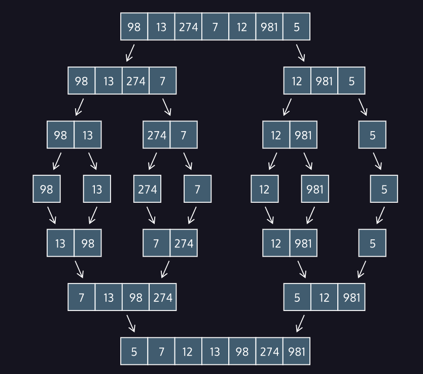

# Merge Sort

## About

Merge sort is a sorting algorithm created by John von Neumann in 1945. Merge sort’s “killer app” was the strategy that breaks the list-to-be-sorted into smaller parts, sometimes called a divide-and-conquer algorithm.

In a divide-and-conquer algorithm, the data is continually broken down into smaller elements until sorting them becomes really simple.

Merge sort was the first of many sorts that use this strategy, and is still in use today in many different applications.

## How To Merge Sort

Merge sorting takes two steps: splitting the data into “runs” or smaller components, and the re-combining those runs into sorted lists (the “merge”).

When splitting the data, we divide the input to our sort in half. We then recursively call the sort on each of those halves, which cuts the halves into quarters. This process continues until all of the lists contain only a single element. Then we begin merging.

When merging two single-element lists, we check if the first element is smaller or larger than the other. Then we return the two-element list with the smaller element followed by the larger element.

## Performance

Merge sort was unique for its time in that the best, worst, and average time complexity are all the same: Θ(N\*log(N)). This means an almost-sorted list will take the same amount of time as a completely out-of-order list. This is acceptable because the worst-case scenario, where a sort could stand to take the most time, is as fast as a sorting algorithm can be.

Some sorts attempt to improve upon the merge sort by first inspecting the input and looking for “runs” that are already pre-sorted. Timsort is one such algorithm that attempts to use pre-sorted data in a list to the sorting algorithm’s advantage. If the data is already sorted, Timsort runs in Θ(N) time.

Merge sort also requires space. Each separation requires a temporary array, and so a merge sort would require enough space to save the whole of the input a second time. This means the worst-case space complexity of merge sort is O(N).
