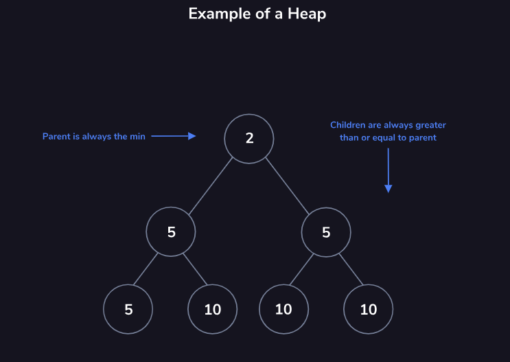
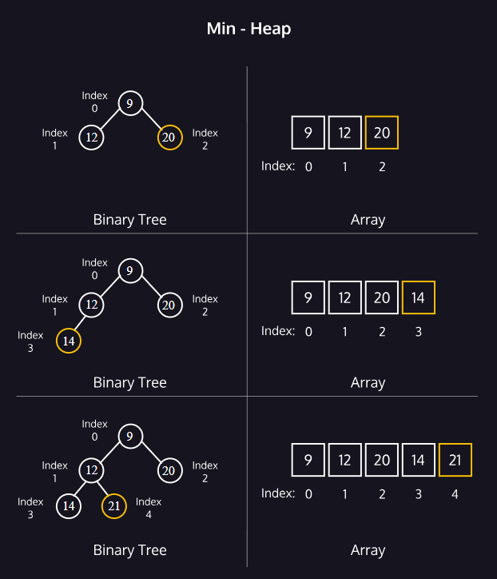
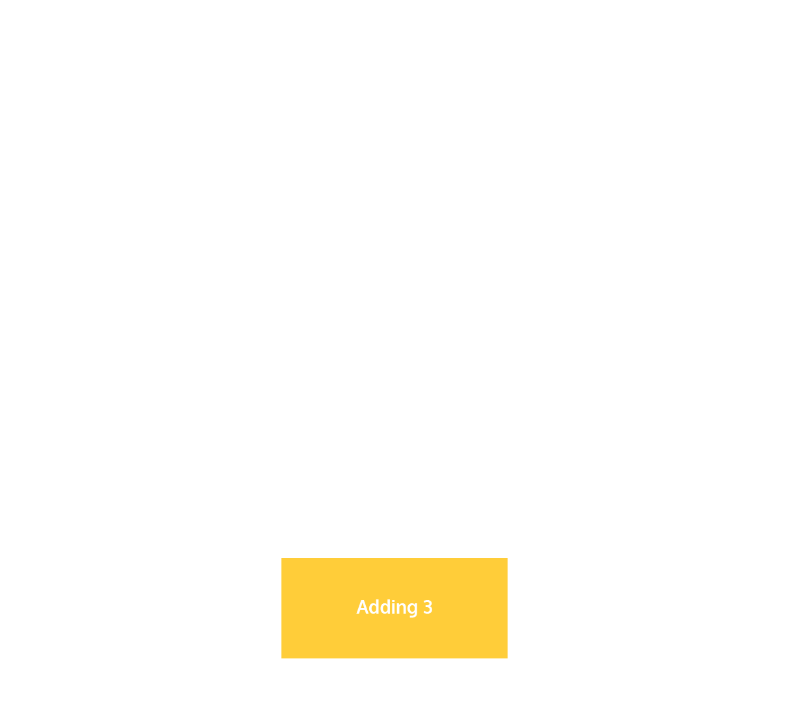
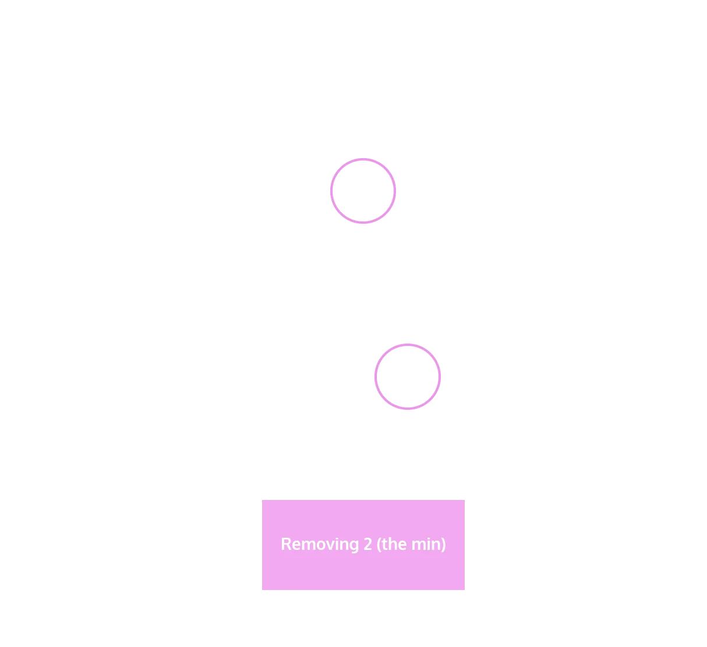
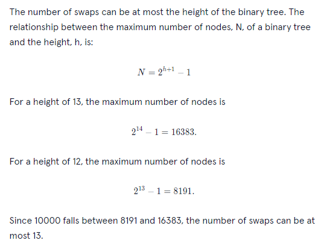

# Heaps

## Introduction

Heaps are used to maintain a maximum or minimum value in a dataset. Our examples use numbers since this is a straight-forward value, but heaps have many practical applications.

Imagine you have a demanding boss (hopefully this is theoretical!). They always want the most important thing done. Of course, once you finish the most important task, another one takes its place.

You can manage this problem using a priority queue to ensure you’re always working on the most pressing assignment and heaps are commonly used to create a priority queue.

Heaps tracking the maximum or minimum value are max-heaps or min-heaps. We will focus on min-heaps, but the concepts for a max-heap are nearly identical.

Think of the min-heap as a binary tree with two qualities:

- The root is the minimum value of the dataset.
- Every child’s value is greater than or equal to its parent.

These two properties are the defining characteristics of the min-heap. By maintaining these two properties, we can efficiently retrieve and update the minimum value.



## Representations

We can picture min-heaps as binary trees, where each node has at most two children. As we add elements to the heap, they’re added from left to right until we’ve filled the entire level.

At the top, we’ve filled the level containing 12 and 20. The next addition comes as the left child of 12, starting a new level in the tree. We would continue filling this level from left to right until 20 had its right child filled.

Conceptually, the tree representation is beneficial for understanding. Practically, we implement heaps in a sequential data structure like an array or list for efficiency.

Notice how by filling the tree from left to right; we’re leaving no gaps in the array. The location of each child or parent derives from a formula using the index.

- left child: (index \* 2) + 1
- right child: (index \* 2) + 2
- parent: (index - 1) / 2 — not used on the root!



## Parent and Child Elements

We use an array for storing internal elements, but we’re modeling it on a binary tree, where every parent element has up to two child elements.

Child and parent elements are determined by their relative indices within the internal heap. By doing some arithmetic on an element’s index, we can determine the indices for parent and child elements (if they exist).

- Parent: (index / 2), rounded down
- Left Child: index \* 2
- Right Child: (index \* 2) + 1

These calculations are important for the efficiency of the heap, but they’re not necessary to memorize, so we have provided three helper functions: getParent(), getLeft(), and getRight() in MinHeap.js.

These helpers take an index as the sole parameter and return the corresponding parent or child index.

```JavaScript
console.log(myHeap.heap)
// returns [null, 10, 13, 21, 61, 22, 23, 99]

getParent(4); // returns (4 / 2) == 2

getLeft(3);   // returns (3 * 2) == 6

getRight(3);  // returns (3 * 2) + 1 == 7
```

## Adding an Element: Heapify Up

Sometimes you will add an element to the heap that violates the heap’s essential properties.

We’re adding 3 as a left child of 11, which violates the min-heap property that children must be larger or equal to their parent.

We need to restore the fundamental heap properties. This restoration is known as heapify or heapifying. We’re adding an element to the bottom of the tree and moving upwards, so we’re heapifying up.

As long as we’ve violated the heap properties, we’ll swap the offending child with its parent until we restore the properties, or until there’s no parent left. If there is no parent left, that element becomes the new root of the tree.

3 swaps with 11, but there’s still work to do because now 3 is a child of 5. One more swap and we’ve restored the heap properties. The parent value, 2, is lesser than the child, 3. We can see that 3‘s children 5 and 14 are also greater.



## Removing an Element: Heapify Down

Maintaining a minimum value is no good if we can never retrieve it, so let’s explore how to remove the root node.

In the diagram, you can see removing the top node itself would be messy: there would be two children orphaned! Instead, we’ll swap the root node, 2, with the bottom rightmost child: 20. The bottom rightmost child is simple to remove because it has no children.

Unfortunately, we’ve violated the heap property. 20 is now the root node, and that’s not the minimum value in the heap. We’ll heapify down to restore the heap property.

This process is similar to heapifying up, except we have two options (5 and 10) where we can make a swap. We’ll choose the lesser of the two values and swap 20 with 5. This is necessary for the heap property, if we had chosen to swap 20 with 10, then the minimum value would not be at the root. With 5 at the root, the root node is the minimum value in the heap again.

Another swap is required because 20 is greater than its children, so we swap 20 with 11.

Now 20 no longer has any children (it is a child of 11), and all other nodes in the heap only have parents with smaller values.

Just like that, we’ve retrieved the minimum value, allocated a new minimum, and maintained the heap property!



## Review

Nice work! You’ve implemented a min-heap in JavaScript, and that’s no small feat (although it could efficiently track the smallest feat).

To recap: MinHeap tracks the minimum element as the element at index 1 within an internal Javascript array.

When adding elements, we use .bubbleUp() to compare the new element with its parent, making swaps if it violates the heap condition: children must be greater than their parents.

When removing the minimum element, we swap it with the last element in the heap. Then we use .heapify() to compare the new root with its children, swapping with the smaller child if necessary.

Heaps are useful because they’re efficient in maintaining their heap condition. Building a heap using elements that decrease in value would ensure that we continually violate the heap condition. How many swaps would that cause?


