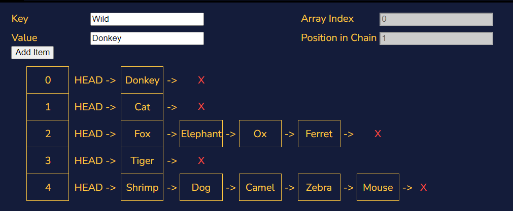
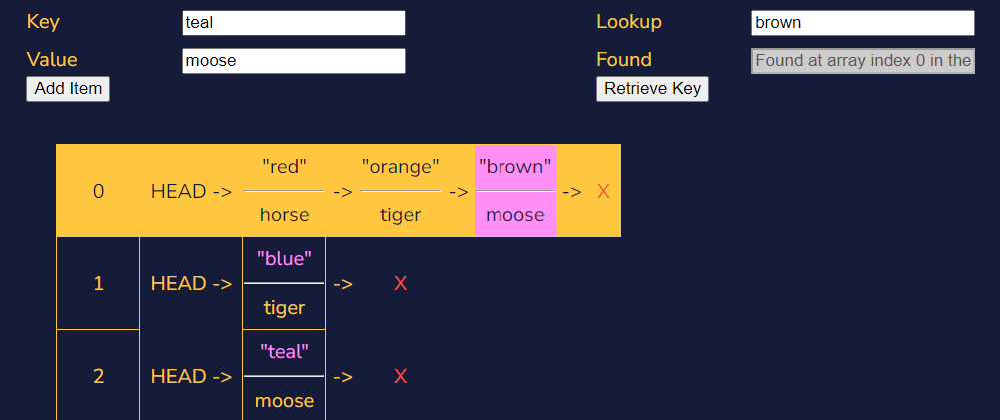

# Maps

Being a map means relating two pieces of information, but a map also has one further requirement. Let’s consider the following table:

| Musician        | State of Birth |
| --------------- | -------------- |
| Miles Davis     | North Carolina |
| John Coltrane   | Illinois       |
| Duke Ellington  | Ohio           |
| Dizzy Gillespie | South Carolina |
| Thelonious Monk | North Carolina |

In the above table we map different jazz musicians to the state where they were born. When talking about a map we describe the inputs (jazz musicians, in this case) as the keys to the map. The output (here the state of origin) is said to be the value at a given key.

In order for a relationship to be a map, every key that is used can only be the key to a single value. In this example every musician can only have one state that they were born in, so it works. There doesn’t need to be a value for every possible key, there just can’t be more than one value for a given key. For instance, Miles Davis can’t be born in both Illinois and Kentucky.

If we looked at this relationship the other way, with states as the keys and jazz musicians born in a given state as values, this would not be a map. In the example above, if we look at “North Carolina” and try to get the jazz musician from that state, we’ll find it very difficult to do. Our relationship would give two different outputs: “John Coltrane” and “Thelonious Monk”. We would still be able to describe that relationship with a table, but it wouldn’t be a map.

## Hash Map Methodology

In the case of a map between two things, we don’t really care about the exact sequence of the data. We only care that a given input, when fed into the map, gives the accurate output. Developing a data structure that performs this is tricky because computers care much more about values than relationships.

We perform this trick using a structure that our computer is already familiar with, an array. An array uses indices to keep track of values in memory, so we’ll need a way of turning each key in our map to an index in our array.

Imagine we want our computer to remember that our good friend Joan McNeil is a Doctor. We take her name, and we turn that name into a number. Let’s say that the number we correspond with the name “Joan McNeil” is 17. We find the 17th index of the array we’re using to store our map and save the value (Doctor) there.

How did we get 17, though? We use a special function that turns data like the string “Joan McNeil” into a number. This function is called a hashing function, or a hash function. Hashing functions are useful in many domains, but for our data structure the most important aspect is that a hashing function returns an array index as output.

## Hash Functions

A hash function takes a string (or some other type of data) as input and returns an array index as output. In order for it to return an array index, our hash map implementation needs to know the size of our array. If the array we are saving values into only has 4 slots, our hash map’s hashing method should not return an index bigger than that.

In order for our hash map implementation to guarantee that it returns an index that fits into the underlying array, the hash function will first compute a value using some scoring metric: this is the hash value, hash code, or just the hash. Our hash map implementation then takes that hash value mod the size of the array. This guarantees that the value returned by the hash function can be used as an index into the array we’re using.

It is actually a defining feature of all hash functions that they greatly reduce any possible inputs (any string you can imagine) into a much smaller range of potential outputs (an integer smaller than the size of our array). For this reason, hash functions are also known as compression functions.

Much like an image that has been shrunk to a lower resolution, the output of a hash function contains less data than the input. Because of this, hashing is not a reversible process. With just a hash value it is impossible to know for sure the key that was plugged into the hashing function.

## Collisions

Remember hash functions are designed to compress data from a large number of possible keys to a much smaller range. Because of this compression, it’s likely that our hash function might produce the same hash for two different keys. This is known as a hash collision. There are several strategies for resolving hash collisions.

### Separate Chaining

The first strategy we’re going to learn about is called separate chaining. The separate chaining strategy avoids collisions by updating the underlying data structure. Instead of an array of values that are mapped to by hashes, it could be an array of linked lists!

A hash map with a linked list separate chaining strategy follows a similar flow to the hash maps that have been described so far. The user wants to assign a value to a key in the map. The hash map takes the key and transforms it into a hash code. The hash code is then converted into an index to an array using the modulus operation. If the value of the array at the hash function’s returned index is empty, a new linked list is created with the value as the first element of the linked list. If a linked list already exists at the address, append the value to the linked list given.

This is effective for hash functions that are particularly good at giving unique indices, so the linked lists never get very long. But in the worst-case scenario, where the hash function gives all keys the same index, lookup performance is only as good as it would be on a linked list. Hash maps are frequently employed because looking up a value (for a given key) is quick. Looking up a value in a linked list is much slower than a perfect, collision-free hash map of the same size. A hash map that uses separate chaining with linked lists but experiences frequent collisions loses one of its most essential features.

### Saving Keys

A hash collision resolution strategy like separate chaining involves assigning two keys with the same hash to different parts of the underlying data structure. How do we know which values relate back to which keys? If the linked list at the array index given by the hash has multiple elements, they would be indistinguishable to someone with just the key.

If we save both the key and the value, then we will be able to check against the saved key when we’re accessing data in a hash map. By saving the key with the value, we can avoid situations in which two keys have the same hash code where we might not be able to distinguish which value goes with a given key.

Now, when we go to read or write a value for a key we do the following: calculate the hash for the key, find the appropriate index for that hash, and begin iterating through our linked list. For each element, if the saved key is the same as our key, return the value. Otherwise, continue iterating through the list comparing the keys saved in that list with our key.

### Open Addressing: Linear Probing

Another popular hash collision strategy is called open addressing. In open addressing we stick to the array as our underlying data structure, but we continue looking for a new index to save our data if the first result of our hash function has a different key’s data.

A common open method of open addressing is called probing. Probing means continuing to find new array indices in a fixed sequence until an empty index is found.

Suppose we want to associate famous horses with their owners. We want our first key, “Bucephalus”, to store our first value, “Alexander the Great”. Our hash function returns an array index 3 and so we save “Alexander the Great”, along with our key “Bucephalus”, into the array at index 3.

After that, we want to store “Seabiscuit”s owner “Charles Howard”. Unfortunately “Seabiscuit” also has a hash value of 3. Our probing method adds one to the hash value and tells us to continue looking at index 4. Since index 4 is open we store “Charles Howard” into the array at index 4. Because “Seabiscuit” has a hash of 3 but “Charles Howard” is located at index 4, we must also save “Seabiscuit” into the array at that index.

When we attempt to look up “Seabiscuit” in our Horse Owner’s Hash Map, we first check the array at index 3. Upon noticing that our key (Seabiscuit) is different from the key sitting in index 3 (Bucephalus), we realize that this can’t be the value we were looking for at all. Only by continuing to the next index do we check the key and notice that at index 4 our key matches the key saved into the index 4 bucket. Realizing that index 4 has the key “Seabiscuit” means we can retrieve the information at that location, Seabiscuit’s owner’s name: Charles Howard.

## Summary

- **Hash map:** A key-value store that uses an array and a hash function to save and retrieve values.
- **Key:** An identifier given to a value for later retrieval.
- **Hash function:** A function that takes some input and returns a number.
- **Compression function:** A function that transforms its inputs into some smaller range of possible outputs.
- **Separate chaining:** A collision resolution strategy that uses an array of linked lists to store key-value pairs.
- **Open addressing:** A collision resolution strategy that uses a single array to store key-value pairs.
- **Linear probing:** A method of open addressing that generates new indices by adding a fixed sequence to the original index.

**Recipe for saving to a hash table:**

1. Take the key and plug it into the hash function, getting the hash code.
2. Modulo that hash code by the length of the underlying array, getting an array index.
3. Check if the array at that index is empty, if so, save the value (and the key) there.
4. If the array is full at that index, continue to the next possible position depending on your collision strategy.

**Recipe for retrieving from a hash table:**

1. Take the key and plug it into the hash function, getting the hash code.
2. Modulo that hash code by the length of the underlying array, getting an array index.
3. Check if the array at that index has contents, if so, check the key saved there.
4. If the key matches the one you're looking for, return the value.
5. If the keys don't match, continue to the next position depending on your collision strategy.
