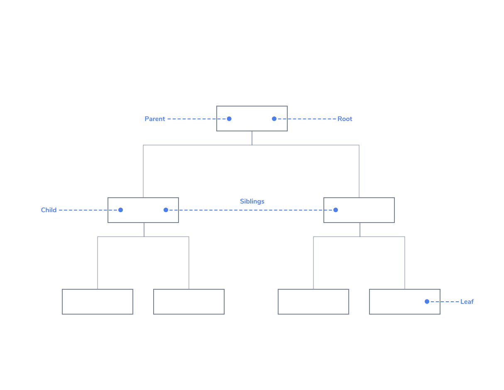
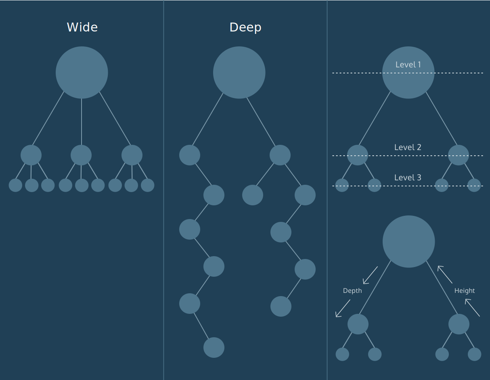

# Trees

## Introduction

Trees are an essential data structure for storing hierarchical data with a directed flow.

Similar to linked lists and graphs, trees are composed of nodes which hold data. The diagram represents nodes as rectangles and data as text.

Nodes also store references to zero or more other tree nodes. Data moves down from node to node. We depict those references as lines drawn between rectangles.

Trees are often displayed with a single node at the top and connected nodes branching downwards.

## Tree Detail

Trees grow downwards in computer science, and a root node is at the very top. When nodes share the same parent node, this makes them siblings. It’s extremely common to have nodes act as both parent and child to different nodes within a tree. When a node has no children, we refer to it as a leaf node.

Trees come in various shapes and sizes depending on the dataset modeled. Some are wide, with parent nodes referencing many child nodes. Some are deep, with many parent-child relationships.

Trees can be both wide and deep, but each node will only ever have at most one parent; otherwise, they wouldn’t be trees!

Each time we move from a parent to a child, we’re moving down a level. Depending on the orientation we refer to this as the depth (counting levels down from the root node) or height (counting levels up from a leaf node).

## Binary Search Tree

Constraints are placed on the data or node arrangement of a tree to solve difficult problems like efficient search.

A binary tree is a type of tree where each parent can have no more than two children, known as the left child and right child.

Further constraints make a binary search tree:

- Left child values must be lesser than their parent.
- Right child values must be greater than their parent.

The constraints of a binary search tree allow us to search the tree efficiently. At each node, we can discard half of the remaining possible values!

Let’s walk through locating the value 31.

1. Start at the root: 39
2. 31 < 39, we move to the left child: 23
3. 23 < 31, we move to the right child: 35
4. 31 < 35, we move to the left child: 31
5. We found the value 31!

In a dataset of fifteen elements, we only made three comparisons. What a deal!

## Summary

Trees are useful for modeling data that has a hierarchical relationship which moves in the direction from parent to child. No child node will have more than one parent.

**root:** A node which has no parent. One per tree.
**parent:** A node which references other nodes.
**child:** Nodes referenced by other nodes.
**sibling:** Nodes which have the same parent.
**leaf:** Nodes which have no children.
**level:** The height or depth of the tree. Root nodes are at level 1, their children are at level 2, and so on.
